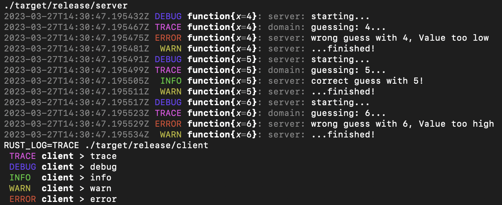

# template-rust

A small rust template with workspace & logging setup.

## cargo workspace

`./Cargo.toml` values are reused across `crates/`.

More about workspace configuration [here](https://doc.rust-lang.org/book/ch14-03-cargo-workspaces.html).

## crates

- `crates/bin-client`
  - logs with [log](https://docs.rs/log/latest/log/) and [pretty_env_logger](https://docs.rs/pretty_env_logger/latest/pretty_env_logger/)
- `crates/bin-server`
  - logs with [tracing](https://docs.rs/tracing/latest/tracing/) to stdout
  - errors made with [thiserror](https://docs.rs/thiserror/latest/thiserror/)
- `crates/domain`
  - logs with [log](https://docs.rs/log/latest/log/)
  - errors made with [thiserror](https://docs.rs/thiserror/latest/thiserror/)

## Github Workflow

`TODO`

- cargo-nextest
- clippy
- cargo-outdated
- cargo-audit
- ignores modifications other than `crates/ & Cargo.toml & Cargo.lock`

## Run

```bash
make all

# or

cargo fmt
cargo test
cargo build --release --bin server
cargo build --release --bin client
./target/release/server
RUST_LOG=TRACE ./target/release/client

# or run with:
cargo run --bin server
RUST_LOG=TRACE cargo run --bin client
```



We get:

- logs from `log`
  - > domain: guessing: x...
- logs & instrumentation from `tracing`
  - > function{x=4}
- concise logging for the client
  - > TRACE client > trace

## Additional non exhaustive libraries

[https://github.com/rust-unofficial/awesome-rust](https://github.com/rust-unofficial/awesome-rust)

### Command line

- [https://github.com/clap-rs/clap](https://github.com/clap-rs/clap) A full featured, fast Command Line Argument Parser for Rust
- [https://github.com/mikaelmello/inquire](https://github.com/mikaelmello/inquire) A Rust library for building interactive prompts

### Database

- [https://github.com/SeaQL/sea-orm](https://github.com/SeaQL/sea-orm) An async & dynamic ORM for Rust
- [https://github.com/launchbadge/sqlx](https://github.com/launchbadge/sqlx) The Rust SQL Toolkit. An async, pure Rust SQL crate featuring compile-time checked queries without a DSL.

### Misc

- [https://github.com/chronotope/chrono](https://github.com/chronotope/chrono) Date and time library for Rust
- [https://github.com/dylanhart/ulid-rs](https://github.com/dylanhart/ulid-rs) Universally Unique Lexicographically Sortable Identifiers

### Serialization and deserialization

- [https://github.com/serde-rs/serde](https://github.com/serde-rs/serde)  Serialization framework for Rust
- [https://github.com/serde-rs/json](https://github.com/serde-rs/json)  Strongly typed JSON library for Rust
- [https://github.com/tokio-rs/prost](https://github.com/tokio-rs/prost)  PROST! a Protocol Buffers implementation for the Rust Language

### Web

[https://www.arewewebyet.org/](https://www.arewewebyet.org/)

#### Client

- [https://github.com/seanmonstar/reqwest](https://github.com/seanmonstar/reqwest) An easy and powerful Rust HTTP Client

#### Front

- [https://github.com/yewstack/yew](https://github.com/yewstack/yew)  Rust / Wasm framework for building client web apps

#### Server

- [https://github.com/tokio-rs/axum](https://github.com/tokio-rs/axum)  Ergonomic and modular web framework built with Tokio, Tower, and Hyper
- [https://github.com/hyperium/tonic](https://github.com/hyperium/tonic)  A native gRPC client & server implementation with async/await support.
